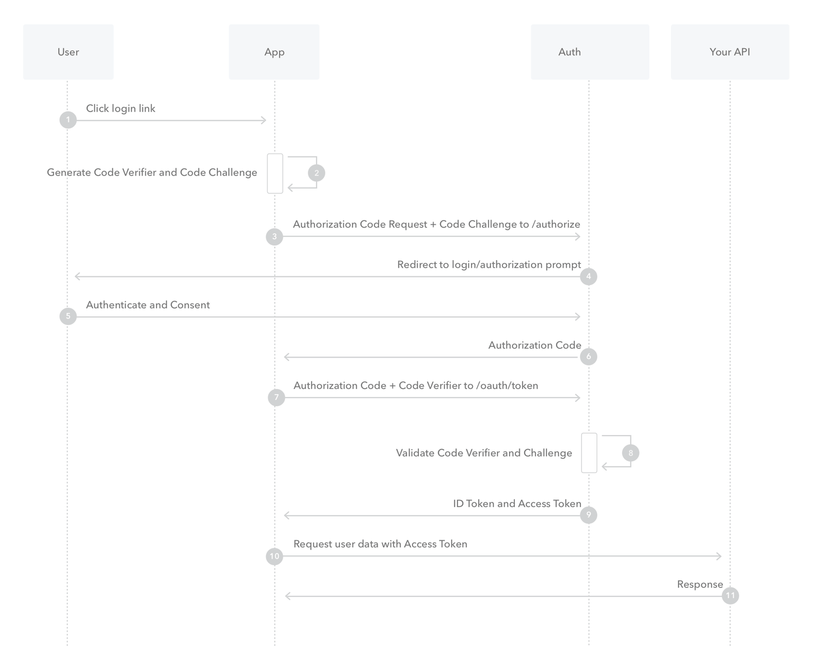
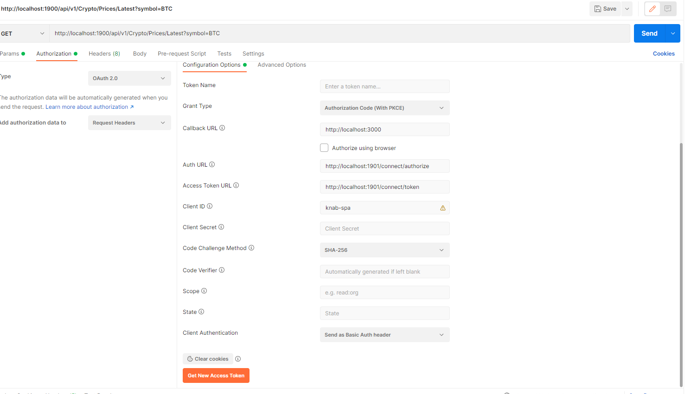

# Knab Software Engineer/Developer (C# .NET Core)

Check the [Answers to technical questions](https://github.com/itsoli91/Knab-Assignment/blob/main/Answer%20to%20technical%20questions.md)

## Backend

The backend consist of two project

1. Knab.Exchange
2. Knab.Identity

Both of this projects are developed using .Net 6.0

### Knab.Exchange

The main code about assessment is inside this project. I have used "Onion Architecture / Clean Architecture" to develop the code, in which outer layers can depend on all inner layers but not the other way around.

### Knab.Identity

Inside this project I have used an open source library called [openiddict](https://github.com/openiddict/openiddict-core) which aims at providing a versatile solution to implement an OpenID Connect server and token validation in .Net core slns.

**Note: for develompent/easy testing purposes I have disabled SSL and also token encryption.**

To enable SSL comment this line in Program.cs file

```C#
.DisableTransportSecurityRequirement();
```

To enable token encryption comment this line in Program.cs file

```C#
if (builder.Environment.IsDevelopment())
            options.DisableAccessTokenEncryption();
```

I have implemented Authorization Code Flow with Proof Key for Code Exchange (PKCE) inside this project.



## Frontend

This project is developed using ReactJS.
This is a sample project that you can use to get the latest changes of BTC through an user Interface. The UI app calls the Knab.Exchange project apis to get data.
This react app also implements Authorization Code Flow with Proof Key for Code Exchange (PKCE), it means to use the dashboard you have to login into the app.

## How to run

1. Install [Docker Desktop](https://www.docker.com/get-started/)
2. Clone the repo.
3. Open the sln in visual studio 2022
4. Set docker-compose as startup project
5. Press Docker-Compose to start the project
6. Please wait a bit, since it needs to download docker images and build the projects.

## Check it works

To check that the sln works you have two option:

### Using UI

1. Open <http://localhost:3000>
2. Click on Login
3. Register a new user
4. That's it! you can now see the latest quests for BTC in the dashboard.

### Using Postman (or similar tools)

1. Open a Get tab in postman and fill the url with this value:
`http://localhost:1900/api/v1/crypto/prices/latest?symbol=BTC`

2. To call the Api you need to be authorized first. Go to authorization tab and fill it with these values:

    * Grant Type: Authorization Code with (PKCE)
    * Callback URL: <http://localhost:3000>
    * Auth URL: <http://localhost:1901/connect/authorize>
    * Access Token URL: <http://localhost:1901/connect/token>
    * Client ID: knab-spa

    Your final configs should be like this image:
    

3. Click on Get new Access token. A new Window will be open for you
4. Register a new user.
5. Press Yes.
6. Click use Token.
7. Press the Send and check the result.
8. You are done!
